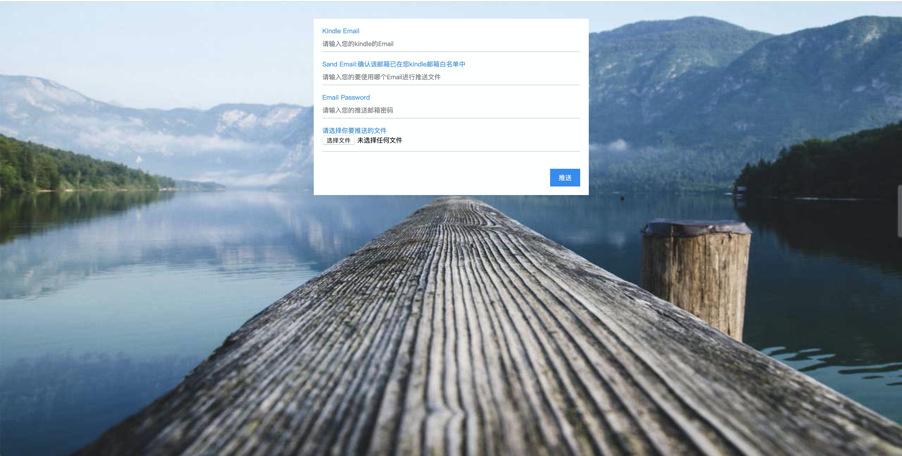

[toc]

# 功能

推送选中的书籍到kindle

## 名词解释

- Kindle Email：你的kindle邮箱
- Send Email：你用来发送书籍到你kindle的邮箱，此邮箱必须在你的kindle的信任邮箱白名单
- Email Password：邮箱密码,163是邮箱密码，QQ是授权码

## 如何查看我kindle邮箱和邮箱白名单

[见百度知道](https://jingyan.baidu.com/article/63acb44a1c968461fcc17eb7.html)

# 搭建

## Docker版

### 依赖

- Docker
- maven

### 部分指令
删除未打包成功的镜像
```shell
docker rmi -f $(docker images | grep '<none>' | awk -F ' ' '{print $3}')
```
获取之前启动的kindle-tool
```shell
pid=$(docker ps -a | grep kindle-tool | awk -F ' ' '{print $1}')
```
停止之前启动的镜像，并且删除之前启动的镜像
```shell
docker stop "$pid" && docker rm "$pid"
```
### 启动镜像
#### V1.0
```shell
docker run -i -t -d --name kindle-tool -p 8084:8084 kindle-tool:latest
```
#### V1.1
增加账号密码本地缓存功能，默认缓存在/root/message
默认缓存
```shell
docker run -i -t -d --name kindle-tool -p 8084:8084 -e "STORAGE_MESSAGE=true" kindle-tool:latest
```
指定缓存路径
-e "STORAGE_MESSAGE_PATH=/root/secret"
```shell
docker run -i -t -d --name kindle-tool -p 8084:8084 -e "STORAGE_MESSAGE=true" -e "STORAGE_MESSAGE_PATH=/root/secret" kindle-tool:latest
```
随着Docker启动而启动
-e "STORAGE_MESSAGE_PATH=/root/secret"
```shell
docker run -i -t -d --name kindle-tool -p 8084:8084 -v /tmp/secret:/root/secret -e "STORAGE_MESSAGE=true" -e "STORAGE_MESSAGE_PATH=/root/secret" --restart=always kindle-tool:latest
```
访问
http://localhost:8084
```
sh build_dockerfile.sh
```


#图示

